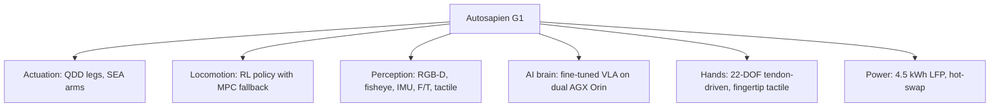

# G1 Architecture: Resolved Technology Decisions

**Duration:** 60 min · **Level:** Foundational · **Module:** 10. G1 Development Roadmap · **Focus:** `G1`, `architecture`, `systems`, `decisions`

Everything in this curriculum has been building toward a single deliverable: a coherent set of architecture decisions you could hand to an engineering team and have them start building. This lesson makes those calls for the Autosapien G1. The point is not that these are the only defensible choices — it is that each one is *resolved*, with a stated rationale and a known risk, so the rest of the program can proceed without re-litigating fundamentals. Treat this as a worked example of how to turn a survey of the state of the art into a committed system design.

## Actuation: a deliberate hybrid

The first decision is the one that constrains every other: how the joints move. The G1 resolution is a **hybrid** — quasi-direct-drive (QDD) motors for the locomotion joints, series-elastic actuators (SEA) for the arm joints. This is not a compromise born of indecision; it matches each actuator to the demand of its joint. Legs make and absorb sharp, repeated contact during walking and stair-climbing, where QDD's backdrivability and clean force estimation pay off. Arms work in sustained, compliant contact with objects and people, where the mechanical spring of an SEA buffers impacts and smooths force control.

The other half of the actuation decision is *sourcing strategy over time*. For the prototype, the G1 uses **HEBI Robotics X5-4 series** modules — off-the-shelf, instrumented, fast to integrate — so the team spends its early budget on control and integration rather than motor design. For production, the plan shifts to **custom in-house actuators**, where form factor, cost, and torque density can be tuned to the platform. The honest tradeoff: buying first de-risks the prototype but means a real re-engineering effort later. We accept that cost because the prototype's job is to validate behavior, not to be manufacturable.

## Locomotion: learned policy with a classical safety net

For walking, the G1 commits to a **reinforcement-learning policy trained in Isaac Lab**, backed by a **model-predictive-control (MPC) fallback controller**. The RL policy delivers the robustness and naturalness that hand-tuned controllers struggle to reach on varied terrain; the MPC fallback provides a predictable, analyzable behavior to drop into when the learned policy's confidence is low or its inputs go out of distribution. You get the performance of learning without surrendering the auditability of classical control.

The targets are explicit and measurable: **1.5 m/s walking, 0.5 m/s stair-climbing, 0.3 m/s backward walking**. Naming these numbers now matters more than their exact values — they convert "walks well" into something a test can pass or fail, and they let the milestone plan in Lesson 10.3 reference concrete acceptance criteria.

## Perception and the AI brain

Sensing is deliberately redundant, because a robot that works around people cannot afford a single blind spot. The G1 carries **four RGB-D cameras** (forward stereo plus bilateral coverage), **two fisheye cameras** for wide situational awareness, **two 6-axis IMUs** for state estimation, **two 6-DOF wrist force/torque sensors**, and **fingertip DIGIT tactile sensors**. The pattern is intentional: rich exteroception for navigation and manipulation, plus proprioception and touch for the contact-rich work that vision alone cannot resolve.

Compute is split across a **dual AGX Orin** setup, and the split is a safety decision as much as a performance one. One Orin runs perception and the vision-language-action (VLA) policy; the second runs locomotion and a safety monitor. Isolating the safety-critical locomotion and monitoring functions on their own processor means a hang or overload in the heavier AI workload cannot take down the robot's ability to stand and stop. For the manipulation policy backbone, the G1 plans to **fine-tune an existing VLA — π0 or OpenVLA** — rather than train from scratch, inheriting a foundation model's general competence and spending data budget on G1-specific skills.

## Hands and power

The hands are where the G1 makes its most ambitious bet: a **custom 22-DOF tendon-driven design** with **DIGIT tactile sensors on all ten fingertips**, a per-hand weight budget **under 800 g**, and a **peak fingertip force of 20 N**. High degrees of freedom plus dense touch are what make genuinely dexterous manipulation possible — but, as Lesson 10.2 will make plain, this same choice is the program's single biggest reliability risk. We commit to it with eyes open.

Power closes the loop on whether the robot is useful for a full shift. The G1 specifies a **4.5 kWh LFP battery** on a **48 V architecture**, targeting **8+ hours at moderate activity**, with a **hot-swap design completable in under five minutes**. LFP buys safety and cycle life; the hot-swap design concedes that no single charge will cover every deployment and designs the workaround in from the start rather than bolting it on later.

## Putting it into practice

Build the one-page architecture decision record that the rest of the program will reference.

1. Make a table with one row per subsystem: actuation, locomotion, perception, AI brain, hands, power.
2. For each row, write the **resolved choice** in a single sentence (e.g., "QDD legs + SEA arms; HEBI X5-4 prototype, custom production").
3. Add a **rationale** column stating *why* this choice beats the obvious alternative for the G1's job.
4. Add a **known risk** column — every honest decision carries one. Pull the hand-reliability and VLA-failure risks straight from Lesson 10.2.
5. Add a **measurable target** column wherever a number exists (1.5 m/s walk, &lt;800 g hands, 8+ hr battery), and leave it blank where one does not — that blank is a flag for future work.
6. Circulate the table as the single source of truth, and require an explicit change request to alter any cell.

## Key takeaways

- The G1's actuation is a deliberate hybrid: QDD for contact-heavy legs, SEA for compliant arms — with HEBI X5-4 modules for the prototype and custom actuators for production.
- Locomotion pairs an Isaac Lab RL policy with an MPC fallback, against explicit targets of 1.5 m/s walking, 0.5 m/s stairs, and 0.3 m/s backward.
- Perception is redundant by design (4 RGB-D, 2 fisheye, 2 IMU, 2 wrist F/T, fingertip DIGIT), and compute splits across dual AGX Orin to isolate safety-critical locomotion.
- The manipulation policy fine-tunes an existing VLA (π0 or OpenVLA) rather than training from scratch.
- The 22-DOF tendon-driven hands with full-fingertip tactile are the most ambitious — and riskiest — subsystem choice.
- Power is a 4.5 kWh LFP pack on 48 V, targeting 8+ hours with sub-five-minute hot-swap.

---

Next: **10.2 Critical Risk Areas & Mitigation Plans** →

*Part of Module 10: G1 Development Roadmap.*

