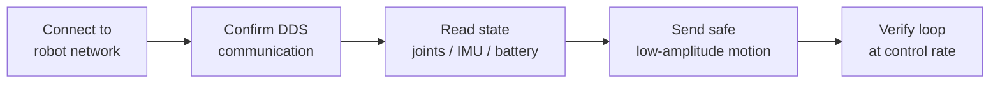

# Reference Build: Bringing Up a Unitree G1

**Duration:** 55 min · **Level:** Advanced · **Module:** 11. Capstone: From Platform to Working Robot · **Focus:** `unitree`, `ROS2`, `SDK`, `bring-up`, `hardware`

This is the hands-on lesson where the robot stops being a spec sheet and starts being a machine you control from your own code. The goal is narrow and concrete: take an unboxed Unitree G1 and get to the point where your program can read its sensor state and command a simple motion, reliably, at the control rate. Everything later in the curriculum — locomotion policies, VLA manipulation — runs on top of this loop, so get it solid before you build anything on it.

## The communication stack: SDK, DDS, and ROS 2

Unitree exposes control through `unitree_sdk2`, a C++ framework with a Python wrapper (via pybind11) for rapid prototyping. It talks to the robot over **CycloneDDS**, a publish/subscribe middleware. The mental model: the robot publishes its state on DDS topics and subscribes to command topics, and your program does the mirror image.

You have a choice of entry point, and they are compatible rather than competing.

**`unitree_sdk2` directly — leanest path.** The SDK talks to the locomotion computer over DDS without any ROS 2 dependency. Reach for this when you want minimal moving parts and full control, or when you are not otherwise in a ROS 2 world.

**`unitree_ros2` bridge — toolchain path.** Because CycloneDDS and ROS 2 are compatible *at the DDS level*, the `unitree_ros2` package bridges the robot's DDS layer to standard ROS 2 topics. Reach for this when you want the rest of the ROS 2 ecosystem — rviz, ros2 bag, Nav2 — to see the robot's state and commands.

**The recommendation:** if your stack is already ROS 2, use `unitree_ros2` so the robot's data flows into tools you already have. If not, use `unitree_sdk2` directly and skip the bridge. Either way you are speaking DDS underneath, so the choice is about tooling, not capability. The authoritative reference is the official G1 developer documentation at `support.unitree.com/home/en/G1_developer`.

## The bring-up sequence

Bring-up follows a fixed order, and each step gates the next. Do not skip ahead — a command sent before communication is confirmed fails silently.



The first concrete step is the network. Connect your computer and the G1 to the same network — a cable and adapter into the G1 switch is the recommended setup for new users — and put your NIC on the robot's subnet. The convention is the `192.168.123.x` range, with `192.168.123.99` recommended for your machine. Until your machine and the robot share that subnet, nothing else will work.

With the network up, install and build the packages:

```bash
# unitree_sdk2 (DDS-based, ROS 2-compatible)
git clone https://github.com/unitreerobotics/unitree_sdk2.git
cd unitree_sdk2 && mkdir build && cd build
cmake .. && make

# or the ROS 2 bridge, if you want standard ROS 2 topics
git clone https://github.com/unitreerobotics/unitree_ros2.git
```

Then confirm DDS communication before commanding anything — subscribe to the robot's state and verify packets are arriving on the right network interface. Only once you can *read* should you *write*.

## Safety is the first feature, not the last

You are about to command a 35 kg machine, so the safety procedure is part of the bring-up, not an afterthought.

Start with the robot suspended or in a stable, supported stance — never free-standing — for your first commanded motions. Command small, low-amplitude motions first; a tiny joint move that behaves correctly tells you the loop works without risking the robot or yourself. Keep a physical e-stop within reach for every test, and treat it as mandatory before any autonomous behavior. The whole point of this lesson is to earn trust in the loop incrementally, and that is impossible if your first command is large.

## What "done" actually means

A successful bring-up has a precise definition, and it is not "the robot moved once." It is this: from your own program, you can read sensor state (joint positions, IMU, battery) **and** command a simple motion reliably, end to end, at the control rate. The word *reliably* is load-bearing — an intermittent connection or a motion that works one time in three is not a working loop, it is a future debugging session.

The final discipline is reproducibility. This ecosystem moves fast; SDK and firmware versions change, and a behavior that works today can break under a silent update. Pin and record the exact `unitree_sdk2` and firmware versions you brought up against. A working bring-up that you cannot reproduce next month is not actually a result you can build on.

## Putting it into practice

Bring up a G1 — or the G1 simulation if hardware is unavailable — to a logged, reproducible state.

1. **Install the stack.** Build `unitree_sdk2` (and `unitree_ros2` if you want the ROS 2 toolchain). Record the exact versions you cloned.
2. **Establish communication.** Put your NIC on the `192.168.123.x` subnet (use `192.168.123.99`), connect to the same network as the robot, and confirm DDS packets are arriving before sending anything.
3. **Read and log state.** Subscribe to and log joint positions, IMU, and battery over several seconds. Confirm the data is sane and arriving at the expected rate.
4. **Command one safe motion.** With the robot suspended or stably supported and an e-stop in reach, command a single low-amplitude motion and confirm it executes as commanded.
5. **Record the environment.** Write down the exact SDK and firmware versions used, so this bring-up is reproducible.

## Key takeaways

- Control flows through `unitree_sdk2` (C++ with a Python/pybind11 wrapper) over CycloneDDS; the SDK works without ROS 2 but is ROS 2-compatible at the DDS level.
- Use `unitree_ros2` when you want the standard ROS 2 toolchain to see the robot; use the SDK directly for the leanest path. The official reference is `support.unitree.com/home/en/G1_developer`.
- Follow the fixed bring-up order: connect to the network → confirm DDS → read state → command a safe motion. Put your NIC on the `192.168.123.x` subnet (`192.168.123.99` recommended).
- Safety is procedural: robot suspended or stably supported, small motions first, e-stop within reach before any autonomous behavior.
- "Done" means you can read state and command a simple motion reliably, end to end, at the control rate — intermittent does not count.
- Pin and record SDK and firmware versions; in a fast-moving ecosystem, a bring-up is only reproducible if the versions are fixed.

---

← Previous: **11.1 Build vs Buy: Choosing Your Platform** · Next: **11.3 Sim-to-Real: Train a Policy and Deploy It on Hardware** →

*Part of Module 11: Capstone: From Platform to Working Robot.*

