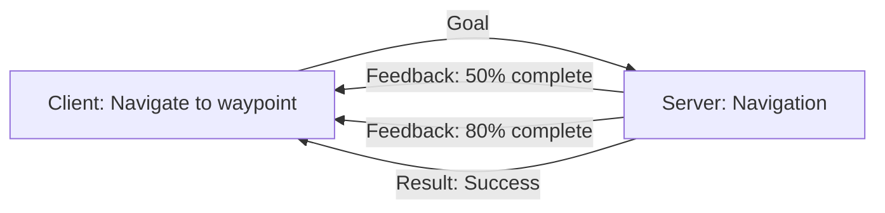

# ROS 2 Basics

<chapter-tools chapterId="module-1/ros2-basics" title="ROS 2 Basics" />

This section covers fundamental ROS 2 concepts you'll use throughout the course.

## What is ROS 2?

**ROS 2** (Robot Operating System 2) is an open-source middleware framework for building robot software. It provides:

- **Communication infrastructure**: Publish/subscribe, services, actions
- **Hardware abstraction**: Unified interface for sensors/actuators
- **Development tools**: Build system (colcon), visualization (RViz), simulation
- **Ecosystem**: 3000+ community packages for navigation, perception, manipulation

:::tip Why ROS 2 vs. ROS 1?
ROS 2 was built from scratch to address ROS 1's limitations: no single master (distributed), real-time support, better security, and native Windows/macOS support.
:::

## Core Concepts

### 1. Nodes

A **node** is an independent process that performs computation. Each node should have a single, well-defined purpose.

**Example**: In a mobile robot, you might have separate nodes for:
- Camera driver (publishes images)
- Object detection (processes images, publishes detections)
- Path planner (plans routes based on detections)
- Motor controller (executes motion commands)

```python
import rclpy
from rclpy.node import Node

class MinimalNode(Node):
    def __init__(self):
        super().__init__('minimal_node')
        self.get_logger().info('Node started!')

def main():
    rclpy.init()
    node = MinimalNode()
    rclpy.spin(node)  # Keep node alive
    rclpy.shutdown()

if __name__ == '__main__':
    main()
```

### 2. Topics & Messages

**Topics** enable asynchronous, many-to-many communication via publish/subscribe.

```python
from std_msgs.msg import String

class Publisher(Node):
    def __init__(self):
        super().__init__('publisher')
        self.pub = self.create_publisher(String, 'chatter', 10)
        self.timer = self.create_timer(1.0, self.timer_callback)

    def timer_callback(self):
        msg = String()
        msg.data = 'Hello ROS 2!'
        self.pub.publish(msg)
```

**Key Points**:
- **Decoupling**: Publishers don't know about subscribers
- **Many-to-many**: Multiple publishers/subscribers on same topic
- **Typed**: Each topic has a fixed message type (e.g., `sensor_msgs/Image`)

### 3. Services

**Services** provide synchronous request/response communication.

```python
from example_interfaces.srv import AddTwoInts

class ServiceServer(Node):
    def __init__(self):
        super().__init__('add_two_ints_server')
        self.srv = self.create_service(
            AddTwoInts,
            'add_two_ints',
            self.add_callback
        )

    def add_callback(self, request, response):
        response.sum = request.a + request.b
        self.get_logger().info(f'{request.a} + {request.b} = {response.sum}')
        return response
```

**When to use services**:
- One-time queries (e.g., "What's the current map?")
- Configuration changes (e.g., "Set max speed to 0.5 m/s")
- NOT for high-frequency data (use topics instead)

### 4. Actions

**Actions** are for long-running tasks that need feedback and cancellation.



**Example use cases**:
- Navigation to a goal pose
- Grasping an object
- Following a trajectory

### 5. Parameters

**Parameters** configure node behavior at runtime.

```python
class ParameterNode(Node):
    def __init__(self):
        super().__init__('parameter_node')
        self.declare_parameter('max_speed', 1.0)
        self.declare_parameter('robot_name', 'robot1')

        max_speed = self.get_parameter('max_speed').value
        self.get_logger().info(f'Max speed: {max_speed} m/s')
```

Load from YAML:
```yaml
parameter_node:
  ros__parameters:
    max_speed: 0.5
    robot_name: 'warehouse_bot'
```

## Coordinate Frames & tf2

Robots operate in 3D space with multiple coordinate frames:

```
world (map)
 └─ robot_base_link
     ├─ laser_frame
     ├─ camera_frame
     └─ wheel_left / wheel_right
```

**tf2** manages relationships between frames:

```python
from tf2_ros import TransformBroadcaster
from geometry_msgs.msg import TransformStamped

broadcaster = TransformBroadcaster(self)

t = TransformStamped()
t.header.stamp = self.get_clock().now().to_msg()
t.header.frame_id = 'world'
t.child_frame_id = 'robot'
t.transform.translation.x = 1.0
t.transform.translation.y = 2.0
t.transform.rotation.w = 1.0

broadcaster.sendTransform(t)
```

## Quality of Service (QoS)

QoS policies control how messages are delivered:

| Policy | Options | Use Case |
|--------|---------|----------|
| **Reliability** | Best Effort, Reliable | Sensor data (best effort) vs. commands (reliable) |
| **Durability** | Volatile, Transient Local | Streaming (volatile) vs. configuration (transient) |
| **History** | Keep Last (N), Keep All | How many messages to buffer |

```python
from rclpy.qos import QoSProfile, ReliabilityPolicy

qos = QoSProfile(
    reliability=ReliabilityPolicy.RELIABLE,
    depth=10
)

self.create_subscription(String, 'topic', callback, qos)
```

## Launch Files

Launch files start multiple nodes with configuration:

```python
from launch import LaunchDescription
from launch_ros.actions import Node

def generate_launch_description():
    return LaunchDescription([
        Node(
            package='camera_driver',
            executable='camera_node',
            name='camera',
            parameters=[{'fps': 30}]
        ),
        Node(
            package='perception',
            executable='detector',
            name='object_detector'
        )
    ])
```

## Development Workflow

### 1. Create Workspace
```bash
mkdir -p ~/ros2_ws/src
cd ~/ros2_ws
colcon build
source install/setup.bash
```

### 2. Create Package
```bash
cd src
ros2 pkg create my_package --build-type ament_python --dependencies rclpy std_msgs
```

### 3. Build and Run
```bash
cd ~/ros2_ws
colcon build --packages-select my_package
source install/setup.bash
ros2 run my_package my_node
```

### 4. Debug with CLI Tools
```bash
# List active nodes
ros2 node list

# List topics
ros2 topic list

# Echo topic messages
ros2 topic echo /scan

# View node graph
ros2 run rqt_graph rqt_graph

# Visualize in RViz
rviz2
```

## Best Practices

### ✅ Do:
- One node, one responsibility
- Use namespaces for multi-robot systems (`/robot1/camera`, `/robot2/camera`)
- Always validate URDF with `check_urdf my_robot.urdf`
- Source workspace in every new terminal
- Use `rclpy.spin_once()` for testing, `rclpy.spin()` for production

### ❌ Don't:
- Create god nodes that do everything
- Hardcode topic names (use parameters or remapping)
- Block callbacks with long computations (use threads/executors)
- Forget to call `super().__init__()` in node constructors
- Mix Python 2 and Python 3 code

## Debugging Tips

### Node not receiving messages?
```bash
# Check if publisher exists
ros2 topic info /my_topic

# Check message frequency
ros2 topic hz /my_topic

# Inspect QoS settings
ros2 topic info /my_topic --verbose
```

### Transform errors?
```bash
# View transform tree
ros2 run tf2_tools view_frames

# Echo specific transform
ros2 run tf2_ros tf2_echo world camera_frame
```

### Build errors?
```bash
# Clean and rebuild
rm -rf build install log
colcon build --symlink-install
```

## Practice Exercise

**Challenge**: Build a "turtle herder" that makes a TurtleSim turtle draw a square.

**Requirements**:
1. Subscribe to `/turtle1/pose` topic
2. Publish to `/turtle1/cmd_vel` topic
3. Move in a square pattern (each side = 2 units)
4. Stop after completing the square

**Starter code**:
```python
import rclpy
from rclpy.node import Node
from geometry_msgs.msg import Twist
from turtlesim.msg import Pose

class TurtleHerder(Node):
    def __init__(self):
        super().__init__('turtle_herder')
        self.pub = self.create_publisher(Twist, '/turtle1/cmd_vel', 10)
        self.sub = self.create_subscription(Pose, '/turtle1/pose', self.pose_callback, 10)

    def pose_callback(self, msg):
        # TODO: Implement square drawing logic
        pass

# TODO: Complete the implementation
```

<details>
<summary>💡 Hint</summary>

Use a state machine:
- State 1: Move forward 2 units
- State 2: Rotate 90 degrees
- Repeat 4 times

Track distance traveled using `msg.x` and `msg.y` from pose updates.
</details>

---

**Next**: Continue to advanced ROS 2 topics in the next module section!
